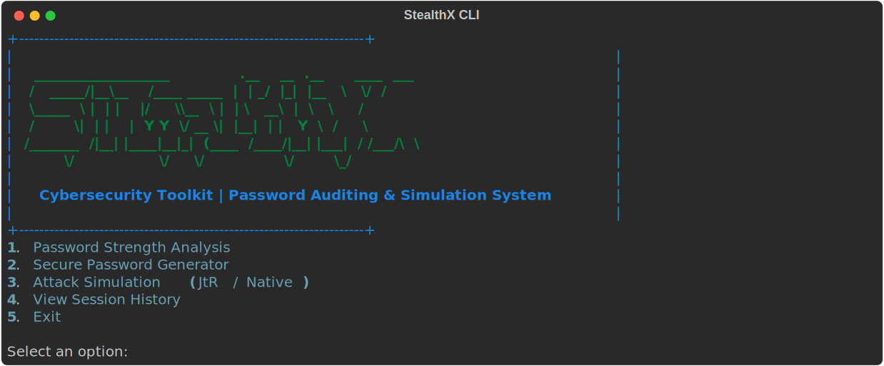
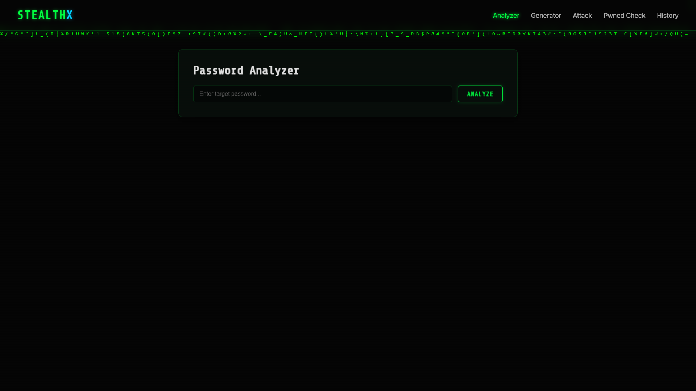

# StealthX

**StealthX** is a comprehensive Cybersecurity Toolkit designed for Password Auditing & Simulation. It provides both Command-Line Interface (CLI) and Graphical User Interface (GUI) applications to help users analyze password strength, generate secure passwords, simulate password cracking attacks, and check for data breaches.

## Features

- **Password Strength Analysis**: Evaluates password strength by calculating entropy and checking against security rules (length, uppercase, lowercase, digits, special characters). It also provides estimated crack times for different scenarios (online vs. offline).
- **Secure Password Generator**: Generates cryptographically secure passwords with customizable parameters (length and character types).
- **Attack Simulation**: Demonstrates password hashing (MD5Crypt) and cracking techniques. It simulates Dictionary, Hybrid, and Brute-Force attacks, optionally using the well-known `rockyou.txt` wordlist.
- **Data Breach Checker**: Integrates with the Have I Been Pwned (HIBP) API to check if a password has appeared in known data breaches.
- **Session History**: Logs actions and analysis results locally for easy review.

## Preview

### Command-Line Interface (CLI)

The CLI application is built with `rich` and provides a beautiful, interactive terminal experience.



### Graphical User Interface (GUI)

The Web GUI provides a sleek, modern dashboard for all your security auditing needs.



## Project Structure

- `cli.py`: The rich command-line interface application.
- `gui_app.py`: The graphical interface application.
- `stealthx_core/`: Contains the core logic modules for the toolkit.
  - `strength.py`: Password strength analysis.
  - `generator.py`: Secure password generation.
  - `simulation.py`: Hashing and attack simulation (John the Ripper / Native).
  - `hibp_checker.py`: Have I Been Pwned API integration.
  - `history.py`: Local session history management.
- `download_rockyou.py`: A helper script to download the `rockyou.txt` wordlist for attack simulation.

## Installation

### For Windows

1. Clone this repository.
2. Ensure you have Python 3.7+ installed.
3. Open PowerShell or Command Prompt in the project folder.
4. Create and activate a virtual environment (recommended):
   ```cmd
   python -m venv venv
   venv\Scripts\activate
   ```
5. Install the required dependencies:
   ```cmd
   pip install -r requirements.txt
   ```

### For Linux / macOS

1. Clone this repository.
2. Ensure you have Python 3.7+ installed.
3. Open your terminal in the project folder.
4. Create and activate a virtual environment (recommended):
   ```bash
   python3 -m venv venv
   source venv/bin/activate
   ```
5. Install the required dependencies:
   ```bash
   pip install -r requirements.txt
   ```

## Usage

*Make sure your virtual environment is activated before running the application.*

### Command Line Interface (CLI)

Run the CLI application for a rich terminal experience:

**Windows:**
```cmd
python cli.py
```
**Linux / macOS:**
```bash
python3 cli.py
```

### Graphical User Interface (GUI)

Run the GUI application for a windowed experience:

**Windows:**
```cmd
python gui_app.py
```
**Linux / macOS:**
```bash
python3 gui_app.py
```

### Attack Simulation Wordlist

To use the dictionary and hybrid attack simulations effectively, you will need the `rockyou.txt` wordlist. You can download it using the provided script:
```bash
python download_rockyou.py
```
*(Note: `rockyou.txt` is intentionally ignored in version control due to its large size.)*

## Disclaimer

This toolkit is intended for **educational and auditing purposes only**. Do not use the attack simulation features against systems or passwords you do not have permission to test.
